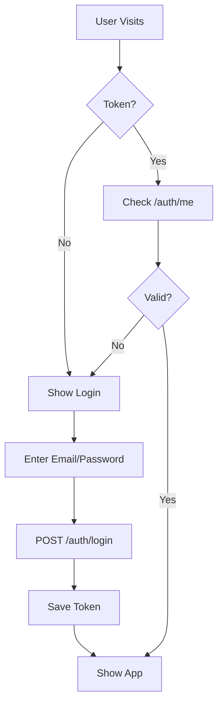
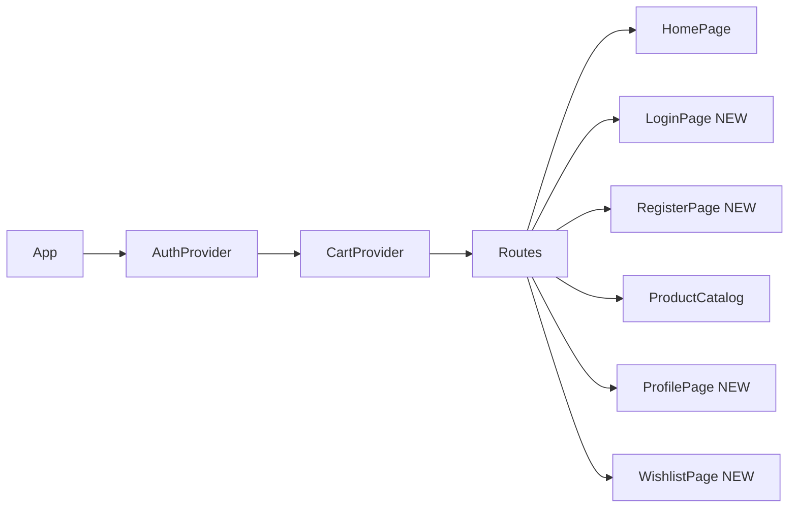
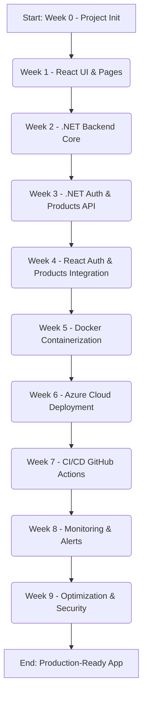

# WEEK 0: Prerequisites & Project Initialization (React)
*2026-03-23*

## 📋 Quick Overview
Set up your local development environment, create your foundational React project, organize its initial directory structure, and establish its version control connection with GitHub. This week creates the blank canvas for your application.

## 🎯 Objectives for the Week
*   Install essential development tools: Git, Node.js, and VS Code.
*   Configure Git with your user information.
*   Create the core React project using Vite.
*   Establish a clean, scalable initial folder structure within the project.
*   Initialize a Git repository for the project.
*   Connect the local repository to a newly created repository on GitHub.
*   Perform the very first commit and push the initial project setup to GitHub.

## 🛠 Technologies
*   Node.js & npm (or Yarn)
*   Git
*   VS Code
*   React 18
*   Vite

---

## **Application Architecture & Design**

Before writing code, it's crucial to understand the high-level architecture of the application.
### **Data Model (Entity Relationship Diagram - ERD)**
This ERD outlines the core entities of our application and how they relate to each other. This will guide both our backend database schema and our frontend data structures.
 ```mermaid
erDiagram
USER ||--o{ ORDER : "places"
USER ||--o{ SAVED_ADDRESS : "has"
USER ||--o{ WISHLIST_ITEM : "adds"
CATEGORY ||--o{ PRODUCT : "has"
PRODUCT ||--o{ WISHLIST_ITEM : "in"
PRODUCT ||--o{ ORDER_ITEM : "contains"
ORDER ||--o{ ORDER_ITEM : "includes"
USER {
int Id PK
string FirstName
string LastName
string Email UK
string PasswordHash
string Phone
boolean IsActive
enum Role
datetime CreatedAt
}
SAVED_ADDRESS {
int Id PK
int UserId FK
string Label
string Address
string Area
boolean IsDefault
}
WISHLIST_ITEM {
int Id PK
int UserId FK
int ProductId FK
datetime AddedAt
}
CATEGORY {
int Id PK
string Name
string Slug
}
PRODUCT {
int Id PK
string Name
decimal Price
int Calories
int CategoryId FK
int StockQuantity
}
ORDER {
int Id PK
string OrderNumber
int UserId FK
string CustomerName
decimal Total
string Status
datetime CreatedAt
}
ORDER_ITEM {
int Id PK
int OrderId FK
int ProductId FK
int Quantity
decimal UnitPrice
}

USER ||--|| SHOPPING_CART : "has"
SHOPPING_CART ||--|{ CART_ITEM : "contains"
PRODUCT ||--o{ CART_ITEM : "is in"

SHOPPING_CART {
    int Id PK
    int UserId FK
    datetime CreatedAt
    datetime UpdatedAt
}

CART_ITEM {
    int Id PK
    int ShoppingCartId FK
    int ProductId FK
    int Quantity
}
```
### **Authentication Flow**
This flowchart shows the user's journey for authentication, from visiting the site to being logged in. It illustrates how the frontend will handle JWT tokens.



### **Frontend Component Hierarchy**
This diagram shows how the main components of our React application will be structured, with global providers wrapping the routing system.



---

## **Overall 10-Week Roadmap Overview**
Here's a visual overview of the 10-week journey, with Week 0 as the starting point:



---

## **Project Initialization & GitHub Connection**

### **STEP 1: Install Essential Tools**
1.  **Install Git:**
    *   **Purpose:** Git is a version control system essential for tracking changes to your code and collaborating with others (via platforms like GitHub).
    *   **How to Install:** Download the installer for your operating system from: [https://git-scm.com/downloads](https://git-scm.com/downloads). Follow the installation wizard, typically accepting the default options.
    *   **Verification:** Open your terminal (e.g., PowerShell on Windows, Terminal on macOS/Linux) and run:
        ```bash
        git --version
        ```
        You should see the installed Git version number (e.g., `git version 2.53.0.windows.2`).
2.  **Install Node.js & npm:**
    *   **Purpose:** Node.js is a JavaScript runtime environment that allows you to run JavaScript code outside of a web browser. `npm` (Node Package Manager) is included with Node.js and is used to install and manage project dependencies (libraries and tools). React projects heavily rely on these.
    *   **How to Install:** Download the LTS (Long Term Support) version installer from: [https://nodejs.org/en](https://nodejs.org/en). Follow the installation instructions.
    *   **Verification:** Open your terminal and run:
        ```bash
        node -v
        npm -v
        ```
        You should see the version numbers for Node.js (e.g., `v24.14.0`) and npm (e.g., `11.9.0`).
3.  **Install Visual Studio Code (VS Code):**
    *   **Purpose:** VS Code is a free, powerful, and highly customizable code editor that is popular for web development.
    *   **How to Install:** Download the installer for your operating system from: [https://code.visualstudio.com/](https://code.visualstudio.com/). Follow the installation steps.

### **STEP 2: Configure Git**
Before making your first commit, tell Git who you are. This information will be associated with all your changes.
```bash
git config --global user.name "Your Name"
git config --global user.email "your.email@example.com"
```
*   Replace `"Your Name"` with your full name (e.g., `"Mahmoud Ahmed"`).
*   Replace `"your.email@example.com"` with the email address linked to your GitHub account (e.g., `"mahmoud.ahmed@example.com"`).

### **STEP 3: Create React Project & Initial Folder Structure**
This step creates the foundational React project and organizes its directories for future development.
1.  **Create a new React project named 'TasteFirst' using Vite:**
    ```bash
    # First, navigate to your desired development directory.
    # For example, to create it directly on your desktop:
    cd C:\Users\Mahm\Desktop\
    # This command uses npm (Node Package Manager) to create a new project.
    # `vite@latest` specifies using the latest version of Vite (a fast build tool).
    # `Healthier` is the name of your project folder that will be created.
    # `-- --template react` tells Vite to use the React template.
    npm create vite@latest TasteFirst -- --template react
    ```
2.  **Move into the newly created project directory:**
    ```bash
    cd TasteFirst
    ```
3.  **Install initial project dependencies:**
    ```bash
    # This command reads the package.json file created by Vite and downloads
    # all necessary initial JavaScript libraries into the 'node_modules' folder.
    npm install
    ```
4.  **Create additional project directories:**
    These directories (`components`, `pages`, `context`, etc.) will house different parts of your application's code in a structured way.
    ```bash
    # The `mkdir -p` command creates directories recursively and doesn't error if they already exist.
    # The `{item1,item2,...}` syntax creates multiple directories at once.
    # Create subdirectories within the 'src/' folder (where most of your React code will live)
    mkdir -p src/{components,pages,context,services,hooks,utils,constants,types,styles}
    # Create a subfolder for images within the 'public/' folder (for static assets served directly)
    mkdir -p public/images
    # Create the '.github/workflows/' directory for future Continuous Integration/Continuous Deployment (CI/CD) configurations
    mkdir -p .github/workflows

    # Create .gitkeep files in src/ subdirectories
    touch src/assets/.gitkeep
    touch src/components/.gitkeep
    touch src/constants/.gitkeep
    touch src/context/.gitkeep
    touch src/hooks/.gitkeep
    touch src/pages/.gitkeep
    touch src/services/.gitkeep
    touch src/styles/.gitkeep
    touch src/types/.gitkeep
    touch src/utils/.gitkeep
    touch public/images/.gitkeep
    touch .github/workflows/.gitkeep
    ```

### **STEP 4: Initialize Git Repository & Connect to GitHub**
This step sets up version control for your project and links it to a remote repository on GitHub.
1.  **Initialize Git:**
    ```bash
    # This command initializes a new, empty Git repository in your current directory.
    # It creates a hidden '.git' folder which Git uses to track all changes.
    git init
    ```
2.  **Add the following content to the .gitignore**
    ````

    .env*                   # Files containing environment variables (often secrets)
    Thumbs.db               # Windows-specific file

    ````
4.  3.  **Create a New Repository on GitHub:**
    You'll now create a blank space on GitHub to store your project remotely.
    *   Go to: [https://github.com/new](https://github.com/new)
    *   **Repository Name:** Enter `TasteFirst-Frontend` (or a similar descriptive name).
    *   **Visibility:** Choose "Public" or "Private" as preferred.
    *   **Crucially, DO NOT initialize this new GitHub repository with:** "Add a README file", "Add .gitignore", or "Choose a license". You've already done these steps locally.
    *   Click "Create repository".
    *   On the next screen, copy the **HTTPS URL** provided (it will look like `https://github.com/YOUR_USERNAME/TasteFirst-Frontend.git`).
    
    **Perform Initial Commit:**
    This command stages all currently untracked files and saves them as the very first version (commit) in your Git history.
    ```bash
    # 'git add .' stages all changes in the current directory and its subdirectories.
    git add .
    # 'git commit -m "..."' creates a new commit with the specified message.
    # This message should briefly describe the changes in the commit.
    git commit -m "feat: Initial React project setup with Vite and folder structure"
    ```


5.  **Add the GitHub repository as a remote origin:**
    This command tells your local Git repository *where* its remote (GitHub) counterpart is located.
    ```bash
    # 'git remote add origin' links your local repo to the remote URL.
    # 'origin' is the conventional name for the primary remote repository.
    git remote add origin https://github.com/YOUR_USERNAME/TasteFirst-Frontend.git
    ```
  
6.  **Push your local commits to GitHub:**
    This uploads your entire local Git history (including your initial commit) to the `main` branch of your GitHub repository.
    ```bash
    # 'git push -u origin main' pushes your local 'main' branch to the 'origin' remote.
    # The '-u' flag sets 'origin main' as the upstream branch,
    # meaning future 'git push' and 'git pull' commands can be run without specifying 'origin main'.
    git push -u origin main
    ```


---
